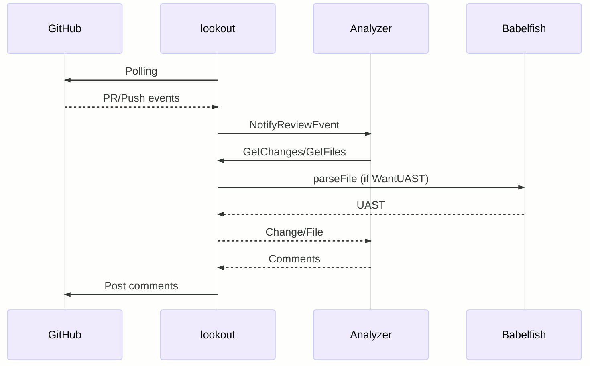

# source{d} Lookout Architecture

You can [edit this image](https://mermaidjs.github.io/mermaid-live-editor/#/edit/eyJjb2RlIjoic2VxdWVuY2VEaWFncmFtXG4gICAgcGFydGljaXBhbnQgR2l0SHViXG4gICAgcGFydGljaXBhbnQgbG9va291dFxuICAgIHBhcnRpY2lwYW50IEFuYWx5emVyXG4gICAgcGFydGljaXBhbnQgQmFiZWxmaXNoXG4gICAgbG9va291dC0-PkdpdEh1YjogUG9sbGluZ1xuICAgIEdpdEh1Yi0tPj5sb29rb3V0OiBQUi9QdXNoIGV2ZW50c1xuICAgIGxvb2tvdXQtPj5BbmFseXplcjogTm90aWZ5UmV2aWV3RXZlbnRcbiAgICBBbmFseXplci0-Pmxvb2tvdXQ6IEdldENoYW5nZXMvR2V0RmlsZXNcbiAgICBsb29rb3V0LT4-QmFiZWxmaXNoOiBwYXJzZUZpbGUgKGlmIFdhbnRVQVNUKVxuICAgIEJhYmVsZmlzaC0tPj5sb29rb3V0OiBVQVNUXG4gICAgbG9va291dC0tPj5BbmFseXplcjogQ2hhbmdlL0ZpbGVcbiAgICBBbmFseXplci0tPj5sb29rb3V0OiBDb21tZW50c1xuICAgIGxvb2tvdXQtPj5HaXRIdWI6IFBvc3QgY29tbWVudHMiLCJtZXJtYWlkIjp7InRoZW1lIjoiZGVmYXVsdCJ9fQ) using [mermaid](https://mermaidjs.github.io). ([sourcecode](assets/lookout-seq-diagram.md))

source{d} Lookout consists of the following components:

## Server

It is the main component, running in a separate process.
It is responsible for orchestrating all the other services.
It takes review requests made by an external code review system, calls the registered analyzers to review the changes, and posts the results back.

The server also exposes **DataService** as a gRPC service.

### DataService

**DataService** gRPC can be called by the analyzers to request a stream (ie. [go](https://grpc.io/docs/tutorials/basic/go.html#server-side-streaming-rpc-1), [python](https://grpc.io/docs/tutorials/basic/python.html#response-streaming-rpc)) of all the files in the repository being analyzed ([FilesRequest](https://github.com/src-d/lookout-sdk/blob/master/proto/lookout/sdk/service_data.proto#L70)), or only the ones that changed ([ChangesRequest](https://github.com/src-d/lookout-sdk/blob/master/proto/lookout/sdk/service_data.proto#L58)). Both requests can be configured to also require either the files content, UASTs and language; the requests can also filter by programming languages, file paths (by regexp), and exclude the [vendored paths](https://github.com/github/linguist/blob/master/lib/linguist/vendor.yml).

**DataServer** also acts as a proxy to Babelfish, so if an analyzer needs to access the Babelfish API, it can point its [Babelfish client](https://docs.sourced.tech/babelfish/using-babelfish/clients) to the same **DataServer** address.

**DataServer** gRPC URL is defined by `LOOKOUT_DATA_SERVER` enviroment value, and its default value is `localhost:10301`.

For the gRPC **DataService** service definiton you can take al look to **[`service_data.proto`](https://github.com/src-d/lookout-sdk/blob/master/proto/lookout/sdk/service_data.proto#L27)**

## Analyzer

_Find more info about what an analyzer is and how to develop your own analyzer in the [**source{d} Lookout Analyzers** documentation](analyzers.md)_

An analyzer is a gRPC service that will be called by the [Server](#server) to perform the smart code analysis, and it will return a set of `Comments` as the result of the analysis.

They are not part of **source{d} Lookout** repository so they can be developed by third parties.

source{d} Lookout Server will call all the registered Analyzers to produce comments for the opened Pull Request in the watched repositories. To register new Analyzers in the configuration file, `lookoutd` will need to be restarted.
